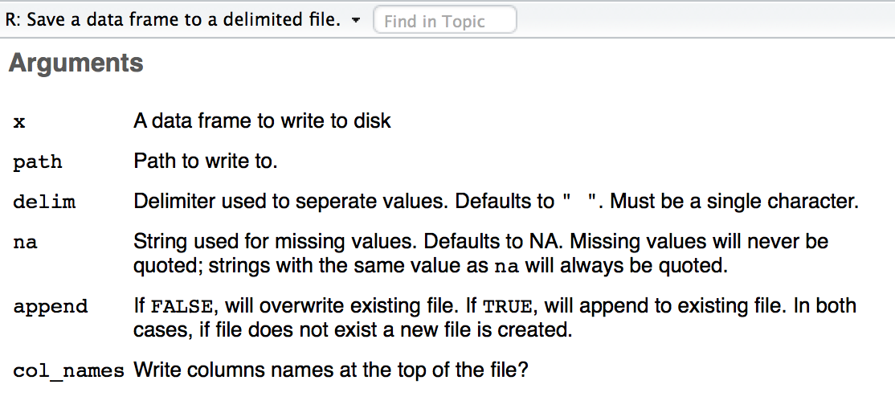
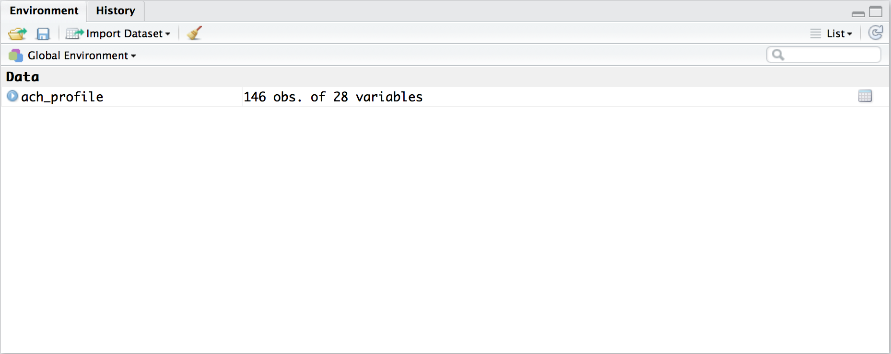
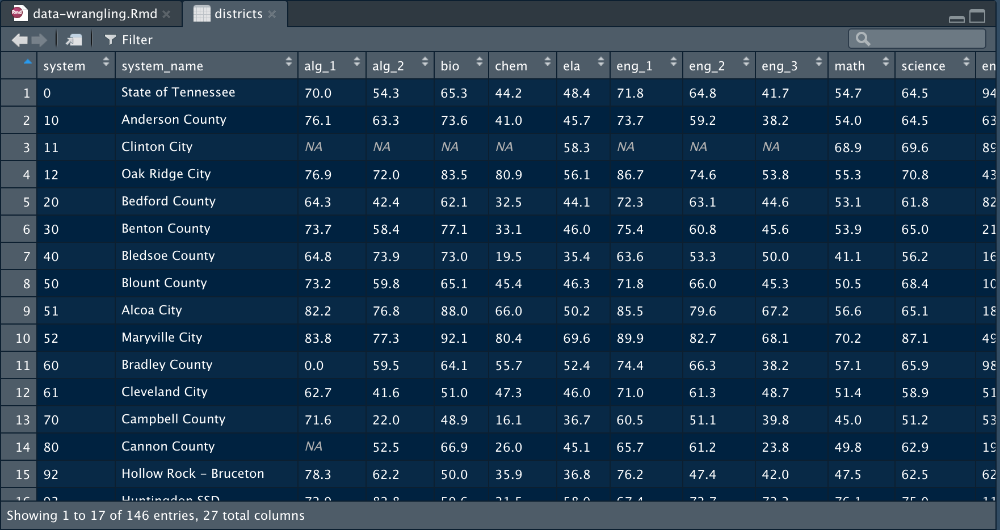
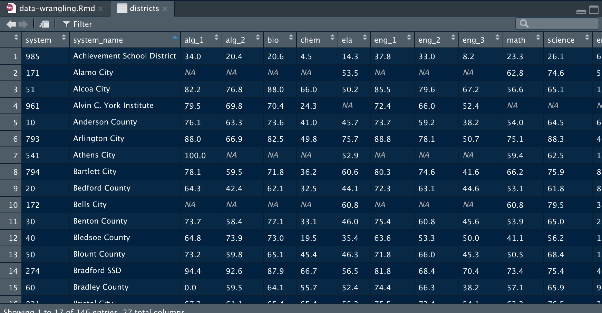
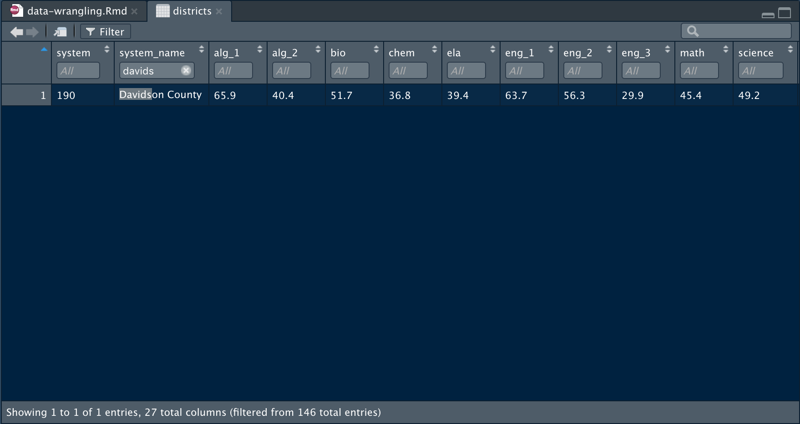

``` {r setup, include = FALSE}
knitr::opts_chunk$set(echo = TRUE, message = FALSE, warning = FALSE)
options(width = 65)

library(readr)
library(tidyr)
library(dplyr)
```

## Tentative Outline for TDoE R Training

> * Introduction to R (Today)
> * Graphics & Documents with R Markdown (October 14th)
> * Interactive Web Applications with `Shiny` (November/December)

. . .

\+ Workshopping time (depending on demand)

## Table of Contents

* Functions
* Packages
* Importing data
* Looking at data
* Summary statistics
* Missingness
* Keeping/dropping variables
* Keeping/dropping observations
* Creating/modifying variables
* The pipe operator (`%>%`)
* Aggregating
* Operations within groups
* Operations within rows
* Combining data frames
* Reshaping

## Functions

Think about a function in math:

$$f(x) = x^2$$

> * This is a function, named $f$, which takes an input $x$, and returns its squared value
> * The input $x$ is called an **argument**

## Functions

Everything that happens in R is the result of a function call.

## Functions

You can write your own functions:

``` {r}
square_me <- function(x) {
    x^2
}
```

. . .

and use them just like any other R function:

``` {r}
square_me(2)
```

## Functions

Call functions with or without explicitly naming the arguments:

Without naming:

``` {r}
square_me(2)
```

. . .

With naming:

``` {r}
square_me(x = 3)
```

## Functions

If a function takes multiple arguments, you can specify them in order without naming them:

``` {r}
power_me <- function(base, exponent) {
    base^exponent
}
```

. . .

``` {r}
power_me(2, 3)
```

R matches the first value to the first argument `base`, and the second to the second argument `exponent`.

## Functions

Alternatively, specify arguments in any order by naming them:

``` {r}
power_me <- function(base, exponent) {
    base^exponent
}
```

``` {r}
power_me(exponent = 3, base = 2)
```

Naming arguments in function calls is generally good practice.

## Functions

Most functions have lots of arguments. Many have a default value so you don't have to specify them.

``` {r}
str(write_csv)
```

. . .

&nbsp;

Specify any argument to override the defaults. For instance, if you don't want `write_csv` to fill in missing values with `"NA"`:

``` {r, eval = FALSE}
write_csv(data_frame, path = "some/file/path", na = "")
```

## Documentation

Read the documentation for a function to see what the arguments do. Type `?[name of function]` in the console to open the documentation.

```{r, eval = FALSE}
?write_csv
```



## Packages

Packages are bundles of functions revolving around a particular purpose (e.g.: data wrangling, graphing).

&nbsp;

Install packages to your computer with `install.packages()` (quotation marks mandatory):

``` {r, eval = FALSE}
install.packages("readr")
```

&nbsp;

> * Do this once per package

## Packages

Packages are bundles of functions revolving around a particular purpose (e.g.: data wrangling, graphing).

&nbsp;

Load packages into your R session with `library()` (quotation marks optional):

``` {r, eval = FALSE}
library(readr)
library("dplyr")
```

&nbsp;

> * Do this in every new R session
> * Alternatively, use any function in any installed package with the notation `package::function()`

## Importing data

|   Type of File   |       Package        |          Function            |
|------------------|----------------------|------------------------------|
|      .csv        |    `readr`           | `read_csv("path/to/file")`   |
|      .xlsx       |    `readxl`          | `read_excel("path/to/file")` |
|      .dta        |    `readstata13`     | `read.dta13("path/to/file")` |

A backslash (\\) serves a special purpose in R, so use forward slashes (/) in file paths.

. . .

e.g.: to read in a .csv:

``` {r, eval = FALSE}
library(readr)
read_csv("path/to/file")
```

or

``` {r, eval = FALSE}
readr::read_csv("path/to/file")
```

## Importing data

Simply reading data from a file just prints it to the console:

``` {r}
read_csv("data/achievement_profile_data_with_CORE.csv")
```

## Importing data

Use the assignment operator `<-` to save your data as an object:

``` {r}
ach_profile <- read_csv("data/achievement_profile_data_with_CORE.csv")
```

. . .



## Looking at data

Use `View()` to look at a data frame:

```{r, eval = FALSE}
View(ach_profile)
```



## Looking at data

The RStudio viewer has Excel like features for sorting and filtering:



## Looking at data

The RStudio viewer has Excel like features for sorting and filtering:



## Looking at data

Alternatively, use `glimpse()` to get an overview of a data frame:

``` {r}
glimpse(ach_profile)
```

## Summary statistics

Some functions for basic summary statistics:

``` {r}
summary(ach_profile)
```

## Summary statistics

Some functions for basic summary statistics:

``` {r}
mean(ach_profile$Pct_ED)
median(ach_profile$Pct_ED)
sd(ach_profile$Pct_ED)
```

## Summary statistics

Tabulations:

``` {r}
table(ach_profile$CORE_region)
```

Correlations:

``` {r}
cor(ach_profile$Pct_ED, ach_profile$Math, use = "complete.obs")
```

## Summary statistics

Note that for all of these functions, using a variable name as the argument doesn't work:

``` {r, error = TRUE}
mean(Pct_ED)
```

. . .

&nbsp;

`mean()` is expecting an object as its first argument, whereas `Pct_ED` is a column vector inside the `ach_profile` object.

## `with()`

Instead of typing `data_frame$variable` many times over, you can use `with()` instead:

``` {r}
with(ach_profile, mean(Pct_ED))

with(ach_profile, cor(Pct_ED, Math, use = "complete.obs"))
```

## Missingness

Missing values in any kind of data are designated `NA`. Check for missing values with `is.na()`:

``` {r, eval = FALSE}
ach_profile$AlgI
```

``` {r, echo = FALSE}
head(ach_profile$AlgI, n = 48)
```

``` {r, eval = FALSE}
is.na(ach_profile$AlgI)
```

``` {r, echo = FALSE}
head(is.na(ach_profile$AlgI), n = 50)
```

## Missingness

Missing values in any kind of data are designated `NA`. Check for missing values with `is.na()`:

``` {r, eval = FALSE}
ach_profile$AlgI
```

``` {r, echo = FALSE}
head(ach_profile$AlgI, n = 48)
```

`TRUE` and `FALSE` act like 1s and 0s, so you can sum them to count missing values:

``` {r}
sum(is.na(ach_profile$AlgI))
```

## Missingness

Calculations with data containing missing values returns `NA` unless you specify `na.rm = TRUE`:

``` {r}
mean(ach_profile$AlgI)

mean(ach_profile$AlgI, na.rm = TRUE)
```

## `dplyr` and `tidyr`

Your two-stop shop for data wrangling:

. . .

 

`dplyr`: pliers, for data frames

## Keeping/dropping variables

Keep variables with `select()`:

``` {r, eval = FALSE}
select(ach_profile, system, system_name)
```

. . .

The first argument to `select()` is a data frame, and the second is the variable(s) you want to keep, separated by commas.

## Keeping/dropping variables

Keep variables with `select()`:

``` {r}
select(ach_profile, system, system_name)
```

## Keeping/dropping variables

Drop variables with `select()` using `-` before a variable name:

``` {r}
select(ach_profile, -system)
```

## Reordering variables

Reorder variables with `select()` by listing the variables in the order you want:

``` {r, eval = FALSE}
select(ach_profile, system, system_name, CORE_region, AlgI:Dropout)
```

. . .

``` {r, echo = FALSE}
select(ach_profile, system, system_name, CORE_region, AlgI:Dropout)
```

## Keeping/dropping observations

Keep observations with `filter()`:

``` {r, eval = FALSE}
filter(ach_profile, system_name == "State of Tennessee")
```

. . .

The first argument to `filter()` is a data frame, and the second is a logical condition describing the observations you want to keep.

## Keeping/dropping observations

Keep observations with `filter()`:

``` {r}
filter(ach_profile, system_name == "State of Tennessee")
```

## Keeping/dropping observations

Drop observations with `filter()` using `!` before a logical condition:

``` {r}
filter(ach_profile, !system_name == "State of Tennessee")
```

## Exercise 1

Use `filter()` to identify districts with 100% Algebra I proficiency.

. . .

``` {r, eval = FALSE}
filter(ach_profile, AlgI == 100)
```

. . .

``` {r, echo = FALSE}
filter(ach_profile, AlgI == 100)
```

## Creating new variables

Create new variables with `mutate()`:

``` {r, eval = FALSE}
mutate(ach_profile, 
    Pct_BHN = Pct_Black + Pct_Hispanic + Pct_Native_American)
```

. . .

The first argument to `mutate()` is a data frame, and the second is a new variable name followed by `=` and an expression for calculating that variable.

## Modifying variables

The syntax for modifying variables with `mutate()` is the same as for creating variables:

``` {r, eval = FALSE}
mutate(ach_profile, Enrollment = Enrollment/1000)
```

## Creating/modifying variables

Create and/or modify arbitrarily many variables with `mutate()`; separate expressions with a comma:

``` {r, eval = FALSE}
mutate(ach_profile, Enrollment = Enrollment/1000,
    Per_Pupil_Expenditures = Per_Pupil_Expenditures/1000)
```

## `ifelse()` with `mutate()`

Use `ifelse()` if you want a variable to take different values under different conditions:

``` {r, eval = FALSE}
mutate(ach_profile, 
    district_size = ifelse(Enrollment >= 10000, "Large", "Small"))
```

&nbsp;

> * The first argument to `ifelse()` is a logical condition.
> * The second is the value of the new variable if the logical condition is `TRUE`.
> * The third is the value of the variable if the logical condition is `FALSE`.

## `ifelse()` with `mutate()`

Use `ifelse()` if you want a variable to take different values under different conditions:

``` {r, eval = FALSE}
mutate(ach_profile, 
    district_size = ifelse(Enrollment >= 10000, "Large", "Small"))
```

``` {r, echo = FALSE}
mutate(ach_profile, district_size = ifelse(Enrollment >= 10000, "Large", "Small")) %>%
    select(system_name, Enrollment, district_size)
```

## `ifelse()` with `mutate()`

Use multiple `ifelse()` statements in succession if you have multiple conditions:

``` {r, eval = FALSE}
mutate(ach_profile, 
    district_size = ifelse(Enrollment >= 10000, "Large", NA),
    district_size = ifelse(Enrollment >= 5000 & Enrollment < 10000, 
        "Medium", district_size),
    district_size = ifelse(Enrollment < 5000, "Small", district_size))
```

. . .

The first `ifelse()` assigns a value of `"Large"` to `district_size` if `Enrollment` is greater or equal to 10000, and `NA` otherwise.

## `ifelse()` with `mutate()`

Use multiple `ifelse()` statements in succession if you have multiple conditions:

``` {r, eval = FALSE}
mutate(ach_profile, 
    district_size = ifelse(Enrollment >= 10000, "Large", NA),
    district_size = ifelse(Enrollment >= 5000 & Enrollment < 10000, 
        "Medium", district_size),
    district_size = ifelse(Enrollment < 5000, "Small", district_size))
```

The second `ifelse()` assigns a value of `"Medium"` to `district_size` if `Enrollment` is between 5000 and 10000, and leaves `district_size` the same otherwise.

## `ifelse()` with `mutate()`

Use multiple `ifelse()` statements in succession if you have multiple conditions:

``` {r, eval = FALSE}
mutate(ach_profile, 
    district_size = ifelse(Enrollment >= 10000, "Large", NA),
    district_size = ifelse(Enrollment >= 5000 & Enrollment < 10000, 
        "Medium", district_size),
    district_size = ifelse(Enrollment < 5000, "Small", district_size))
```

The third `ifelse()` assigns a value of `"Small"` to `district_size` if `Enrollment` is less than 5000, and leaves `district_size` the same otherwise.

## `ifelse()` with `mutate()`

``` {r, eval = FALSE}
mutate(ach_profile, 
    district_size = ifelse(Enrollment >= 10000, "Large", NA),
    district_size = ifelse(Enrollment >= 5000 & Enrollment < 10000, 
        "Medium", district_size),
    district_size = ifelse(Enrollment < 5000, "Small", district_size))
```

``` {r, echo = FALSE}
mutate(ach_profile, 
    district_size = ifelse(Enrollment >= 10000, "Large", NA),
    district_size = ifelse(Enrollment >= 5000 & Enrollment < 10000, "Medium", district_size),
    district_size = ifelse(Enrollment < 5000, "Small", district_size)) %>%
    select(system_name, Enrollment, district_size)
```

## Exercise 2

Create a new variable called `math_achievement` with a value of:
    
* `"High"` if a district's Math proficiency is 75% or higher;
* `"Medium"` if a district's Math proficiency is between 50% and 75%;
* `"Low"` if a district's Math proficiency is below 50%.

&nbsp;

. . .

``` {r eval = FALSE}
mutate(ach_profile,
    math_achievement = ifelse(Math >= 75, "High", NA),
    math_achievement = ifelse(Math >= 50 & Math < 75, "Medium", 
                              math_achievement),
    math_achievement = ifelse(Math < 50, "Low", math_achievement))
```

## Exercise 2

Create a new variable called `math_achievement` with a value of:
    
* `"High"` if a district's Math proficiency is 75% or higher;
* `"Medium"` if a district's Math proficiency is between 50% and 75%;
* `"Low"` if a district's Math proficiency is below 50%.

``` {r echo = FALSE}
mutate(ach_profile,
    math_achievement = ifelse(Math >= 75, "High", NA),
    math_achievement = ifelse(Math >= 50 & Math < 75, "Medium", 
                              math_achievement),
    math_achievement = ifelse(Math < 50, "Low", math_achievement)) %>%
    select(system_name, Math, math_achievement)
```

## The pipe operator (`%>%`)

Often, you will want to do several data manipulations in succession. This can be a hassle if you have to nest a bunch of function calls:

``` {r, eval = FALSE}
mutate(select(filter(ach_profile, system_name != "State of Tennessee"), 
    system_name, Enrollment:Per_Pupil_Expenditures), 
    Enrollment = log10(Enrollment))
```

. . .

Or assign each intermediate step to a variable:

``` {r, eval = FALSE}
ach_profile2 <- filter(ach_profile, system_name != "State of Tennessee")
ach_profile3 <- select(ach_profile2, 
                       system_name, Enrollment:Per_Pupil_Expenditures)
ach_profile4 <- mutate(ach_profile3, Enrollment = log10(Enrollment))
```

## The pipe operator (`%>%`)

The pipe operator (`%>%`) provides a better alternative. It passes the result of one function as the first argument to another function:

``` {r, eval = FALSE}
ach_profile %>%
    filter(system_name != "State of Tennessee") %>%
    select(system_name, Enrollment:Per_Pupil_Expenditures) %>%
    mutate(Enrollment = log10(Enrollment))
```

## Exercise 3

Filter down to district 792 (Shelby County), then pipe the result to `View()`.

. . .

``` {r, eval = FALSE}
ach_profile %>%
    filter(system == 792) %>%
    View()
```

## Exercise 3

``` {r, eval = FALSE}
ach_profile %>%
    filter(system == 792) %>%
    View()
```


## Renaming variables

Rename variables with `rename()`:

```{r, eval = FALSE}
rename(ach_profile, District = system)
```

. . .

The first argument to `select()` is a data frame, followed by pairs of names with the pattern `new_name = old_name`.

## Renaming variables

Rename variables with `rename()`:

```{r}
rename(ach_profile, District = system)
```

## Renaming variables

Variable names can contain spaces and other characters. Put backticks (``) around a name if it contains spaces.

```{r, eval = FALSE}
rename(ach_profile, District = system, 
       `District Name` = system_name)
```

. . .

```{r, echo = FALSE}
rename(ach_profile, District = system, 
       `District Name` = system_name)
```

## Exercise 4

Do the following in one sequence of function calls, piped together:

1. Read in the `data/tvaas.csv` file.
2. Rename variables as follows:
    * `District Name` to `system`.
    * `District-Wide: Composite` to `TVAAS Composite`.
    * `District-Wide: Literacy` to `TVAAS Literacy`.
    * `District-Wide: Numeracy` to `TVAAS Numeracy`.
3. Drop the `District Name` variable.

Assign the result to a object named `tvaas`.

## Exercise 4

``` {r}
tvaas <- read_csv("data/tvaas.csv") %>%
    rename(system = `District Number`,
           `TVAAS Composite` = `District-Wide: Composite`,
           `TVAAS Literacy` = `District-Wide: Literacy`,
           `TVAAS Numeracy` = `District-Wide: Numeracy`) %>%
    select(-`District Name`)
```

. . .


## Exercise 4


## Sorting a data frame

Sort a data frame with `arrange()`:

```{r, eval = FALSE}
arrange(ach_profile, system_name)
```

The first argument to `arrange()` is a data frame, and the second is the variable(s) you want to sort on.

## Sorting a data frame

Sort a data frame with `arrange()`:

```{r}
arrange(ach_profile, system_name)
```

## Sorting a data frame

`arrange()` sorts numeric variables in ascending order and string variables alphabetically; `desc(var_name)` reverses this.

``` {r}
arrange(ach_profile, desc(system_name))
```

## Exercise 5

Sort alphabetically CORE region, then by Algebra I proficiency in descending order. Then, keep just the district name, Algebra I proficiency, and CORE region variables.

. . .

``` {r, eval = FALSE}
ach_profile %>%
    arrange(CORE_region, desc(AlgI)) %>%
    select(system_name, AlgI, CORE_region)
```

. . .

``` {r, echo = FALSE}
ach_profile %>%
    arrange(CORE_region, desc(AlgI)) %>%
    select(system_name, AlgI, CORE_region)
```

## Collapsing a data frame

Collapse a data frame into summary statistics with `summarise()`:

``` {r}
ach_profile %>%
    summarise(mean(Math, na.rm = TRUE), 
              mean(ELA, na.rm = TRUE))
```

The first argument is a data frame, and the second is any summary statistic(s) you want to compute, separated by a comma.

## Collapsing a data frame

Collapse a data frame into summary statistics with `summarise()`:

``` {r}
ach_profile %>%
    summarise(mean_math = mean(Math, na.rm = TRUE), 
              mean_ELA = mean(ELA, na.rm = TRUE))
```

You can also supply variable names to the resulting data frame.

## Exercise 6

Use `summarise()` to find the mean, minimum, and maximum district graduation rate. Assign variable names to the resulting data frame.

. . .

``` {r, eval = FALSE}
ach_profile %>%
    filter(system_name != "State of Tennessee") %>%
    summarise(mean_grad = mean(Graduation, na.rm = TRUE),
              min_grad = min(Graduation, na.rm = TRUE),
              max_grad = max(Graduation, na.rm = TRUE))
```

. . .

``` {r, echo = FALSE}
ach_profile %>%
    filter(system_name != "State of Tennessee") %>%
    summarise(mean_grad = mean(Graduation, na.rm = TRUE),
              min_grad = min(Graduation, na.rm = TRUE),
              max_grad = max(Graduation, na.rm = TRUE))
```

## Collapsing a data frame

Use `group_by()` with `summarise()` to aggregate data to a higher unit of analysis (e.g.: student to school level; school to district level):

``` {r, eval = FALSE}
ach_profile %>%
    group_by(CORE_region) %>%
    summarise(Math = mean(Math, na.rm = TRUE), 
              ELA = mean(ELA, na.rm = TRUE))
```

. . .

&nbsp;

* The argument to `group_by()` is the variable(s) that define your groups.

## Collapsing a data frame

Use `group_by()` with `summarise()` to aggregate data to a higher unit of analysis (e.g.: student to school level; school to district level):

``` {r}
ach_profile %>%
    group_by(CORE_region) %>%
    summarise(Math = mean(Math, na.rm = TRUE), 
              ELA = mean(ELA, na.rm = TRUE))
```

## Collapsing a data frame

After doing operations with `group_by()`, be sure to `ungroup()` your data frame.

``` {r, eval = FALSE}
ach_profile %>%
    group_by(CORE_region) %>%
    summarise(Math = mean(Math, na.rm = TRUE), 
              ELA = mean(ELA, na.rm = TRUE)) %>%
    ungroup()
```

. . .

`group_by()` affects all `dplyr` verbs, e.g.:

* Can't drop grouping variables with `select()`
* `arrange()` sorts on grouping variables first

## Add summary statistics to a data frame

Instead of collapsing, you might want to add summary statistics as variables to a data frame. 

. . .

Do this with `mutate()`:

``` {r, eval = FALSE}
ach_profile %>%
    mutate(Math_mean = mean(Math, na.rm = TRUE))
```

. . .

This calculates the mean of Math %P/A, and creates a variable `Math_mean` with that value across all observations.

## Add summary statistics to a data frame

Instead of collapsing, you might want to add summary statistics as variables to a data frame.

Do this with `mutate()`:

``` {r, eval = FALSE}
ach_profile %>%
    mutate(Math_mean = mean(Math, na.rm = TRUE))
```

``` {r, echo = FALSE}
ach_profile %>%
    mutate(Math_mean = mean(Math, na.rm = TRUE)) %>%
    select(system_name, Math, Math_mean)
```

## Exercise 7

Identify districts with a higher Percent ED than the median district, and a higher Math proficiency than the median district.

. . .

``` {r, eval = FALSE}
ach_profile %>%
    filter(system_name != "State of Tennessee") %>%
    mutate(median_pct_ED = median(Pct_ED, na.rm = TRUE),
        median_Math = median(Math, na.rm = TRUE)) %>%
    filter(Pct_ED > median_pct_ED & Math > median_Math)
```

## Exercise 7

Identify districts with a higher Percent ED than the median district, and a higher Math proficiency than the median district.

``` {r, echo = FALSE}
ach_profile %>%
    filter(system_name != "State of Tennessee") %>%
    mutate(median_pct_ED = median(Pct_ED, na.rm = TRUE),
        median_Math = median(Math, na.rm = TRUE)) %>%
    filter(Pct_ED > median_pct_ED & Math > median_Math) %>%
    select(system, system_name, Math, median_Math)
```

## Add summary statistics to a data frame

Use `group_by()` to add summary statistics by group:

``` {r}
ach_profile %>%
    group_by(CORE_region) %>%
    mutate(Math_mean = mean(Math, na.rm = TRUE)) %>%
    ungroup() %>%
    select(system_name, CORE_region, Math, Math_mean)
```

## Combining data frames

When combining data frames, you're doing one of two things:

* Adding observations on the same variables
* Adding variables on the same units

## Combining data frames

Add observations on the same variables with `bind_rows()`:

. . .

``` {r, eval = FALSE}
state <- filter(ach_profile, system_name == "State of Tennessee")
districts <- filter(ach_profile, system_name != "State of Tennessee")

bind_rows(state, districts)
```

. . .

``` {r, echo = FALSE}
state <- filter(ach_profile, system_name == "State of Tennessee")
districts <- filter(ach_profile, system_name != "State of Tennessee")

bind_rows(state, districts)
```

## Combining data frames

Add variables on the same units with a **join**. 

. . .

A join requires a **key**, one or more variables matching observations in one data frame to those in the second.

. . .

A key should uniquely identify observations in one or both of your data frames.

## Combining data frames

We will join `ach_profile` and `tvaas` data frames using `system` as a key.

A numeric id is generally better than a name as a key, because names might be slightly discrepant (e.g.: spelling, capitalization).

## Combining data frames

There are five types of joins:

* `inner_join()` keeps only merged observations in both data frames
* `left_join()` drops unmerged observations in the second data frame
* `right_join()` drops unmerged observations in the first data frame
* `full_join()` keeps all observations in both data frames
* `anti_join()` keeps only unmerged observations in both data frames

## Combining data frames

We will join the `ach_profile` and `tvaas` data frames using `district` as a key.

``` {r, eval = FALSE}
left_join(ach_profile, tvaas, by = "system")
```

The first two arguments to any `join` function are two data frames, and the third is the key variable(s).

## Combining data frames

If there are multiple key variables, specify them as a character vector:

``` {r, eval = FALSE}
left_join(df1, df2, by = c("key_var1", "key_var2"))
```

## Combining data frames

We will join the `ach_profile` and `tvaas` data frames using `district` as a key.

``` {r, echo = FALSE}
left_join(ach_profile, tvaas, by = "system")
```

## Exercise 8

Create a data frame with the number of districts at each TVAAS level, by CORE region.

. . .

``` {r, eval = FALSE}
ach_profile %>%
    inner_join(tvaas, by = "system") %>%
    mutate(Level1 = ifelse(`TVAAS Composite` == 1, 1, 0),
           Level2 = ifelse(`TVAAS Composite` == 2, 1, 0),
           Level3 = ifelse(`TVAAS Composite` == 3, 1, 0),
           Level4 = ifelse(`TVAAS Composite` == 4, 1, 0),
           Level5 = ifelse(`TVAAS Composite` == 5, 1, 0)) %>%
    group_by(CORE_region) %>%
    summarise(Level1 = sum(Level1, na.rm = TRUE),
              Level2 = sum(Level2, na.rm = TRUE),
              Level3 = sum(Level3, na.rm = TRUE),
              Level4 = sum(Level4, na.rm = TRUE),
              Level5 = sum(Level5, na.rm = TRUE)) %>%
    ungroup()
```

## Exercise 8

Create a data frame with the number of districts at each TVAAS level, by CORE region.

``` {r, eval = FALSE}
ach_profile %>%
    inner_join(tvaas, by = "system") %>%
    mutate(Level1 = `TVAAS Composite` == 1,
           Level2 = `TVAAS Composite` == 2,
           Level3 = `TVAAS Composite` == 3,
           Level4 = `TVAAS Composite` == 4,
           Level5 = `TVAAS Composite` == 5) %>%
    group_by(CORE_region) %>%
    summarise(Level1 = sum(Level1, na.rm = TRUE),
              Level2 = sum(Level2, na.rm = TRUE),
              Level3 = sum(Level3, na.rm = TRUE),
              Level4 = sum(Level4, na.rm = TRUE),
              Level5 = sum(Level5, na.rm = TRUE)) %>%
    ungroup()
```

## Exercise 8

Create a data frame with the number of districts at each TVAAS level, by CORE region.

``` {r, echo = FALSE}
ach_profile %>%
    inner_join(tvaas, by = "system") %>%
    mutate(Level1 = `TVAAS Composite` == 1,
           Level2 = `TVAAS Composite` == 2,
           Level3 = `TVAAS Composite` == 3,
           Level4 = `TVAAS Composite` == 4,
           Level5 = `TVAAS Composite` == 5) %>%
    group_by(CORE_region) %>%
    summarise(Level1 = sum(Level1, na.rm = TRUE),
              Level2 = sum(Level2, na.rm = TRUE),
              Level3 = sum(Level3, na.rm = TRUE),
              Level4 = sum(Level4, na.rm = TRUE),
              Level5 = sum(Level5, na.rm = TRUE)) %>%
    ungroup()
```

## Troubleshooting

1. Look at the documentation
    + Type `?[name of function]` into the console to pull up the documentation for a function
2. Look for examples on the web
    + Google "R [name of package and/or function]" or "R [what you want to do]"
    + There are often more elaborate examples and vignettes on the web than in the documentation
3. Stack Overflow + Google Groups
    + Forums with lots of answered questions, or ask your own

&nbsp;
&nbsp;
&nbsp;
&nbsp;
&nbsp;

. . .

<small>(Ask Alex)</small>

## Resources

* The online book **R for Data Science**: http://r4ds.had.co.nz/
* RStudio cheat sheets: https://www.rstudio.com/resources/cheatsheets/
* The Datacamp `dplyr` course: https://www.datacamp.com/courses/dplyr-data-manipulation-r-tutorial
