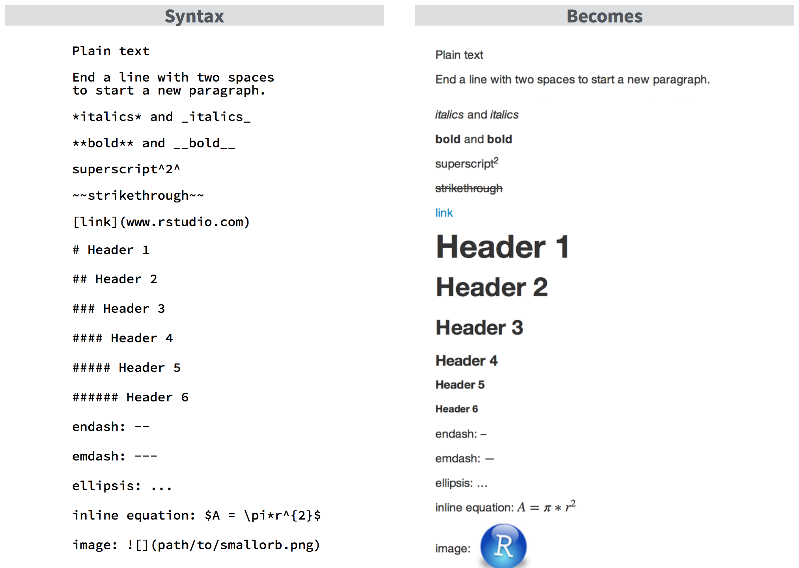
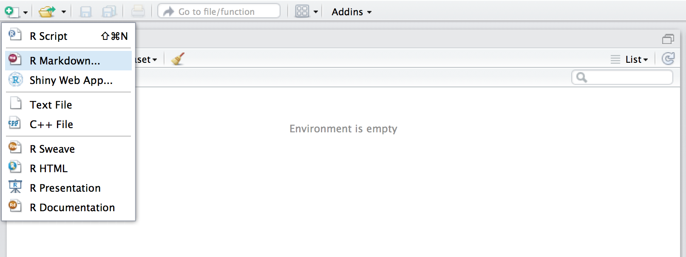
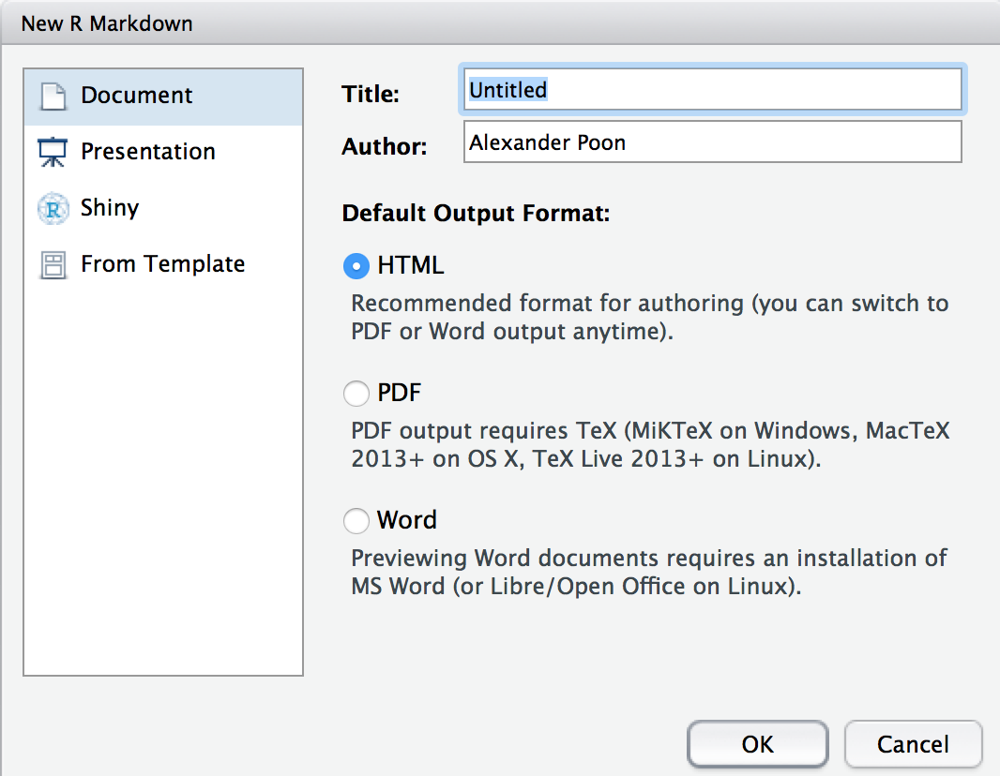
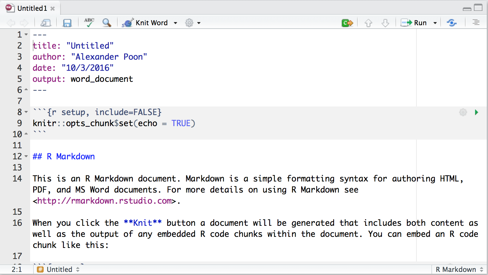
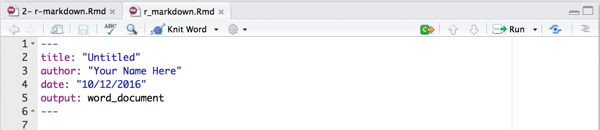
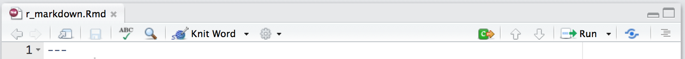
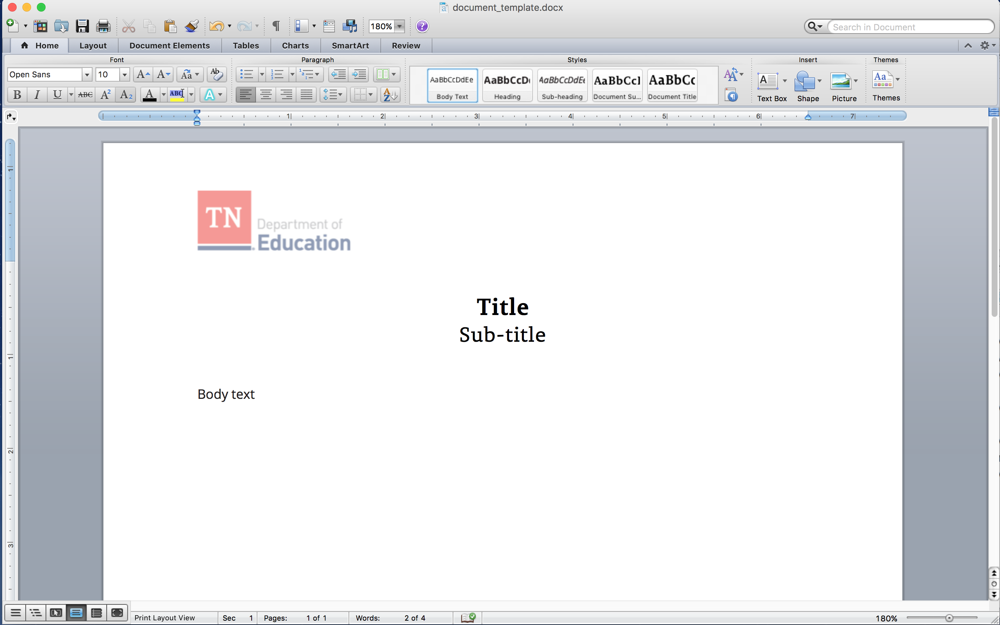
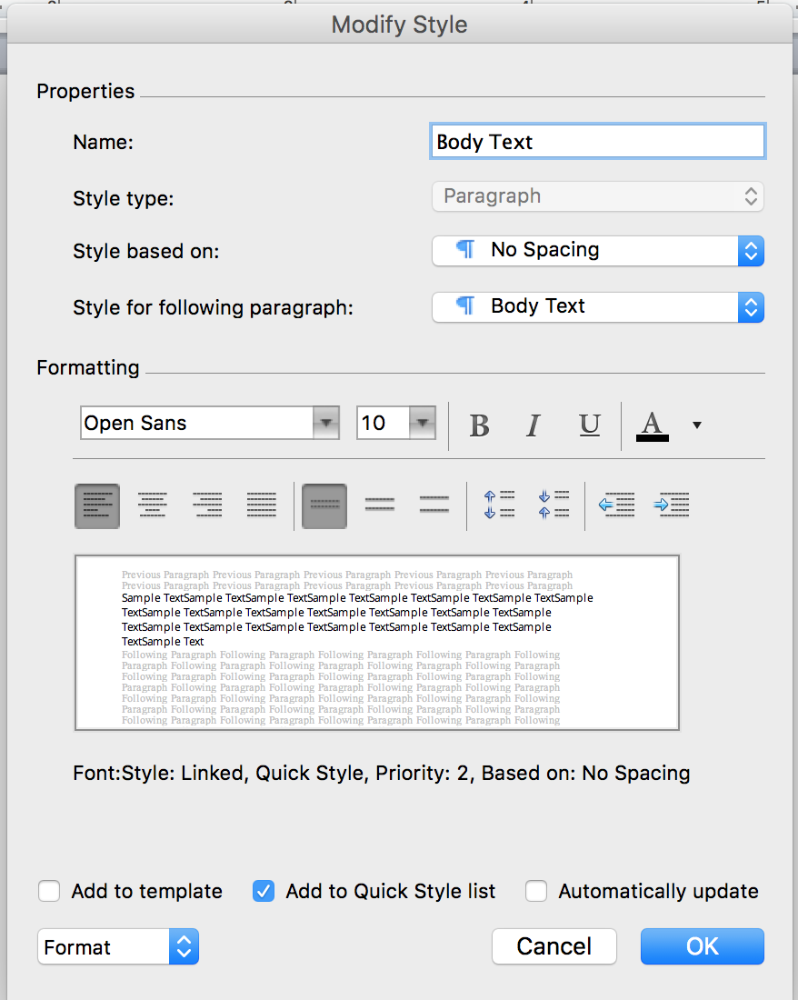

``` {r setup, include = FALSE}
knitr::opts_chunk$set(echo = TRUE, message = FALSE, warning = FALSE)

library(tidyverse)

ach_profile <- read_csv("data/achievement_profile_data_with_CORE.csv")
```

## Today's Materials

### Find them at https://github.com/alexander-poon/teaching

Click on "Clone or Download" to download.

## Markdown

A language for creating and formatting documents.

. . .

Mostly plain text, with simple marks for formatting.

. . .

Plenty of references online: <http://www.rstudio.com/wp-content/uploads/2015/03/rmarkdown-reference.pdf>

## Markdown



## R Markdown

Markdown + R

. . .

Create Word documents, PDFs, HTML pages, and HTML presentations for maximum reproducibility.

## R Markdown

Create a new R Markdown document in RStudio.



## R Markdown

Select the kind of document you want to create.



## R Markdown



## R Markdown

Use the **YAML Header** to specify a title, author, the type of output, and other options.



. . .

Options for output:

* `html_document` for a webpage
* `word_document` for a MS Word document
* `pdf_document` for a PDF (requires an installation of LaTeX)
* `ioslides_presentation` (among others) for an HTML presentation

## Render the Document

Click the **Knit** button (Ctrl + Shift + K) to render the document.



## Inline Expressions

There are two ways to add R to your documents.

. . .

The first is to use **inline expressions**. This is useful for including R output seamlessly in text, e.g.:

Today's date is ` `r knitr::inline_expr('Sys.Date()')` `.

&nbsp;

. . .

When you render the document, this will turn into:

Today's date is `r Sys.Date()`.

## Inline Expressions

There are two ways to add R to your documents.

The first is to use **inline expressions**. This is useful for including R output seamlessly in text, e.g.:

Today's date is ` `r knitr::inline_expr("format(Sys.Date(), '%B %d, %Y')")` `.

&nbsp;

When you render the document, this will turn into:

Today's date is `r format(Sys.Date(), '%B %d, %Y')`.

## Exercise 1

* Add a second level header before the **Introduction** section: "Davidson County District Performance".

* Fill in the statement with the appropriate values from the `ach_profile` data frame:

    Davidson County is a school district serving ____ students. Its expenditures in 2015 were ____ per student.

## Exercise 1

* Add a second level header before the **Introduction** section: "Davidson County District Performance".

. . .

`## Davidson County District Performance`

## Exercise 1

* Fill in the statement with the appropriate values from the `ach_profile` data frame:

    Davidson County is a school district serving ____ students. Its expenditures in 2015 were ____ per student.

. . .

&nbsp;

`ach_profile[ach_profile$system_name == "Davidson County"`
`, ]$Enrollment`

. . .

`ach_profile[ach_profile$system_name == "Davidson County"`
`, ]$Per_Pupil_Expenditures`

## Exercise 1

* Fill in the statement with the appropriate values from the `ach_profile` data frame:

    Davidson County is a school district serving ____ students. Its expenditures in 2015 were ____ per student.

&nbsp;

`ach_profile %>% filter(system_name == "Davidson County")`
`%>% select(Enrollment)`

. . .

`ach_profile %>% filter(system_name == "Davidson County")`
`%>% select(Per_Pupil_Expenditures)`

## Exercise 1

* Fill in the statement with the appropriate values from the `ach_profile` data frame:

    Davidson County is a school district serving ____ students. Its expenditures in 2015 were ____ per student.

&nbsp;

Davidson County is a school district serving `r ach_profile[ach_profile$system_name == "Davidson County", ]$Enrollment` students. Its expenditures in 2015 were $`r sprintf("%.2f", ach_profile[ach_profile$system_name == "Davidson County", ]$Per_Pupil_Expenditures)` per student.

## Code Chunks

The other is to use **code chunks**. This is useful for complicated R expressions and looks like the following:

` ``` {r} `

` plot(ach_profile$Pct_ED, ach_profile$Math) `

` ``` `

## Code Chunks

The other is to use **code chunks**. This is useful for complicated R expressions and looks like the following:

``` {r}
plot(ach_profile$Pct_ED, ach_profile$Math)
```

## Code Chunks

There are many options for code chunks, which can apply to individual chunks, or globally across a document.

. . .

A few useful ones:

* `echo` - whether to show R code (defaults to `TRUE`)
* `message` - whether to show messages (defaults to `TRUE`)
* `error` - whether to show errors (defaults to `TRUE`)
* `cache` - whether to save the output of some chunk (defaults to `FALSE`)
* `fig.width` and `fig.height` - size of plots in your output (defaults to 7x7)

. . .

See <http://yihui.name/knitr/options/#chunk_options> for a full list.

## Code Chunks

Specify chunk options globally with `knitr::opts_chunk$set()`:

`knitr::opts_chunk$set(echo = FALSE)`

## Code Chunks

Specify chunk options inside the braces, separated by commas, e.g.:

` ``` {r, echo = FALSE, fig.height = 5} `

`plot(ach_profile$Pct_ED, ach_profile$Math)`

` ``` `

## Code Chunks

Specify chunk options inside the braces, separated by commas, e.g.:

``` {r, echo = FALSE, fig.height = 5}
plot(ach_profile$Pct_ED, ach_profile$Math)
```

## Exercise 2

Produce a table with % BHN, ED, SWD, and EL for Davidson County and the State:

. . .

``` {r, echo = FALSE}

ach_profile %>%
    filter(system_name %in% c("Davidson County", "State of Tennessee")) %>%
    select(system_name, Pct_BHN, Pct_ED, Pct_SWD, Pct_EL) %>%
    rename(`Black/Hispanic/Native American` = Pct_BHN, `Economically Disadvantaged` = Pct_ED, `Students with Disabilities` = Pct_SWD, `English Learners` = Pct_EL) %>%
    gather(Subgroup, `Percentage of Students`, 2:5) %>%
    spread(system_name, `Percentage of Students`) %>%
    mutate_each(funs(paste0(., "%")), -Subgroup) %>%
    knitr::kable()

```

(Create a table in R Markdown with `knitr::kable()`)

## Exercise 2

Produce a table with % BHN, ED, SWD, and EL for Davidson County and the State:

```{r, echo = TRUE, eval = FALSE}

ach_profile %>%
    filter(    ) %>%
    select(    ) %>%
    rename(    ) %>%
    gather(    ) %>%
    spread(    ) %>%
    knitr::kable()

```

## Exercise 2

Produce a table with % BHN, ED, SWD, and EL for Davidson County and the State:

```{r, echo = TRUE, eval = FALSE}

ach_profile %>%
    filter(system_name %in% c("Davidson County", "State of Tennessee")) %>%
    select(system_name, Pct_BHN, Pct_ED, Pct_SWD, Pct_EL) %>%
    rename(`Black/Hispanic/Native American` = Pct_BHN, `Economically Disadvantaged` = Pct_ED, `Students with Disabilities` = Pct_SWD, `English Learners` = Pct_EL) %>%
    gather(Subgroup, `Percentage of Students`, 2:5) %>%
    spread(system_name, `Percentage of Students`) %>%
    knitr::kable()

```

## Exercise 2

Produce a table with % BHN, ED, SWD, and EL for Davidson County and the State:

``` {r, echo = TRUE, eval = FALSE}

ach_profile %>%
    filter(system_name %in% c("Davidson County", "State of Tennessee")) %>%
    select(system_name, Pct_BHN, Pct_ED, Pct_SWD, Pct_EL) %>%
    rename(`Black/Hispanic/Native American` = Pct_BHN, `Economically Disadvantaged` = Pct_ED, `Students with Disabilities` = Pct_SWD, `English Learners` = Pct_EL) %>%
    gather(Subgroup, `Percentage of Students`, 2:5) %>%
    spread(system_name, `Percentage of Students`) %>%
    mutate(`Davidson County` = paste0(`Davidson County`, "%"),
        `State of Tennessee` = paste0(`State of Tennessee`, "%")) %>%
    knitr::kable()

```

## Exercise 2

Produce a table with % BHN, ED, SWD, and EL for Davidson County and the State:

``` {r, echo = FALSE}

ach_profile %>%
    filter(system_name %in% c("Davidson County", "State of Tennessee")) %>%
    select(system_name, Pct_BHN, Pct_ED, Pct_SWD, Pct_EL) %>%
    rename(`Black/Hispanic/Native American` = Pct_BHN, `Economically Disadvantaged` = Pct_ED, `Students with Disabilities` = Pct_SWD, `English Learners` = Pct_EL) %>%
    gather(Subgroup, `Percentage of Students`, 2:5) %>%
    spread(system_name, `Percentage of Students`) %>%
    mutate(`Davidson County` = paste0(`Davidson County`, "%"),
        `State of Tennessee` = paste0(`State of Tennessee`, "%")) %>%
    knitr::kable()

```

## Word Documents

If output is a Word document, use an existing Word document (located in your working directory) as a template to specify, e.g.:

* Fonts
* Spacing
* Page numbers
* TDoE logo in the header

## Word Template



## Word Template

Set parameters for each style (Level 1 Header, Level 2 Header, Body Text, etc.) in Word:



## References

* `knitr` documentation - <http://yihui.name/knitr/>
* Markdown reference - <http://www.rstudio.com/wp-content/uploads/2015/03/rmarkdown-reference.pdf>
